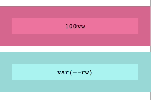
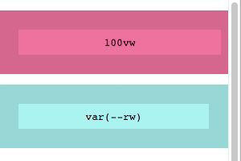

<h1 align="center">root-units<span aria-role="presentation"><br>💯+🎚=👌</span></h1>
<p align="center">
  <strong>What you really wanted when you asked for viewport units.</strong>
</p>
<p align="center">
  
   
</p>

## Usage

This:

```js
require('root-units').install();
```

...enables this:

```css
.Thing {
  width: var(--vw);
  /* ^ 100% of <html> width */
  height: calc(var(--vh) / 2);
  /* ^ 50% of <html> height */
}
```

...because this:


## How it works

When you call `.install()`, the following happens*:

* The CSS custom properties `--rw` and `--rh` are added to the root element (`document.documentElement`) matching its `clientWidth` and `clientHeight` values. 
* Event handlers are attached to `window`'s `resize` and `orientationchange` events, which takes another measurement of the root element's width & height. 
* If either value has changed since the last measurement, we update the CSS custom properties.

### *"…but [#perfmatters](https://twitter.com/hashtag/perfmatters?src=hash)!"*, I hear you cry…

Worry not: as soon as measurements have changed, further events are ignored until the CSS custom properties have been updated. This results in as few DOM reads/writes as possible. Even more importantly, **measurements and mutations follow a simple asynchronous scheduling pattern which you can control**. There's not much point in you taking the time to optimise DOM reads/writes in your app, then drop in this little utility which fires up its own render loop and causes a bunch of layout thrashing.

### How it *actually* works

* Event handlers are attached to `window`'s `resize` and `orientationchange` events, which schedule a measurement of the root element's dimensions. By default, this is postponed to the next tick of the event loop (using `setTimeout`).
* A measurement is manually scheduled, followed by a manually scheduled mutation (this is how the initial CSS custom properties are created).
* Each scheduled mutation will update the CSS custom properties if they've changed, then re-schedule itself (creating a loop). By default, this happens in the next frame (using `requestAnimationFrame`).

If you want to take full control of this scheduling, you can provide your own functions as options and manually call `measure` and `mutate` when it best suits your app's architecture:

```js
require('root-units')
.install({
  scheduleMeasurement: measure => {
    setTimeout(measure, 0);
  },
  scheduleMutation: mutate => {
    window.requestAnimationFrame(mutate);
  }
});
```

The functions above show the workings of the internal defaults, but you're free to replace them with whatever you want, e.g. [fastdom](https://github.com/wilsonpage/fastdom)):


```js
const fastdom = require('fastdom');

require('root-units')
.install({
  scheduleMeasurement: fastdom.measure,
  scheduleMutation: fastdom.mutate
});
```

## Example

Clone this repo then:

```shell
$ npm install && npm start
```

...and open 🔗 [localhost:8080](http://localhost:8080)
