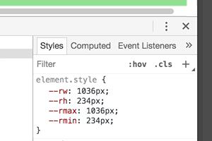

<h1 align="center">root-units<span aria-role="presentation"><br>💯+🎚=👌</span></h1>
<p align="center">
  <strong>What you really wanted when you asked for viewport units.</strong>
</p>
<p align="center">
  
   
</p>

## Usage

This:

```js
require('root-units').install();
```

...enables this:

```css
.Thing {
  width: var(--vw);
  /* ^ 100% of <html> width */
  height: calc(var(--vh) / 2);
  /* ^ 50% of <html> height */
}
```

...because this:



## *"Wait. Why do I need this?"*

Viewport units were an awesome idea. They let us set CSS properties to lengths that are proportion to the viewport's width, height, or the min/max of the two. There's a small caveat that'll trip you up sooner or later though : they don't play nicely with scroll bars.

You see, we never know when scroll bars are going to appear, or what form they'll take. On many touch/hybrid devices (and some desktop devices, dependant on settings), scroll bars appear as little transparent pills that float up and down the side of the page, above the content. In this case, `100vw` is the same as the root element's `clientWidth` value, so we can be sure that it will fill 100% of the client width. However, some scroll bars appear inside the viewport, reducing the root element's width/height by `~15px` (on average), but [viewport units don't take the reduced client dimensions into account](https://www.w3.org/TR/css3-values/#viewport-relative-lengths). If you hadn't noticed that before, jump to the beginning of this README and have a look at those distracting GIFs for a moment. I'll wait.

Did you see that? the first example has the floaty scroll bar, and everything is as cool as. The second example highlights the problem I'm trying to solve. Read on for how I actually did that...

## How it works

When you call `.install()`, the following happens*:

* The CSS custom properties `--rw` and `--rh` are added to the root element (`document.documentElement`) matching its `clientWidth` and `clientHeight` values. 
* Event handlers are attached to `window`'s `resize` and `orientationchange` events, which takes another measurement of the root element's width & height. 
* If either value has changed since the last measurement, we update the CSS custom properties.

### *"…but [#perfmatters](https://twitter.com/hashtag/perfmatters?src=hash)!"*, I hear you cry…

Worry not: if the root element's size changes, further events are ignored until the CSS custom properties have been updated. This results in as few DOM reads/writes as possible. Even more importantly, **measurements and mutations follow a simple asynchronous scheduling pattern which you can control**. There's not much point in you taking the time to optimise DOM reads/writes in your app, then drop in this little utility and cause a bunch of unwanted layout thrashing.

### \*How it *actually* works

* Event handlers are attached to `window`'s `resize` and `orientationchange` events, which can schedule a measurement of the root element's dimensions. By default, this is posponed to the next render frame (using `requestAnimationFrame`).
* If the dimensions have changed since the last measurement, a mutation is scheduled, which will update the CSS custom properties. By default, this happens in the same frame as the measurement.
* A measurement is manually scheduled, which allows the initial CSS custom properties to be created.

If you want to take full control of this scheduling, you can provide your own functions as options. They'll be called with a single argument (either the `measureTask` or `mutateTask` function), letting you manually run those tasks when it best suits your app's architecture:

```js
require('root-units')
.install({
  measure: window.requestAnimationFrame,
  mutate: mutateTask => mutateTask()
});
```

The above example shows the default behaviour, but you're free to replace that with whatever strategy suits you. Maybe you want to also run `measureTask` in the same tick of the event loop:

```js
require('root-units')
.install({
  measure: measureTask => measureTask()
});
```

...or appoint a purpose-built library such as [fastdom](https://github.com/wilsonpage/fastdom):

```js
const fastdom = require('fastdom');

require('root-units')
.install({
  measure: fastdom.measure.bind(fastdom),
  mutate: fastdom.mutate.bind(fastdom)
});
```

Find what works best for you!

## Try it out

1) Clone this repo, 2) install the development server and 3) fire it up:

```shell
git clone git@github.com:colingourlay/root-units.git
cd root-units
npm install && npm start
```

4) Open 🔗 [localhost:8080](http://localhost:8080) and start poking around your dev tools.

To switch between examples, which demonstrate alternative scheduling strategies, (un)comment the relevant sections in [example.js](example.js)
